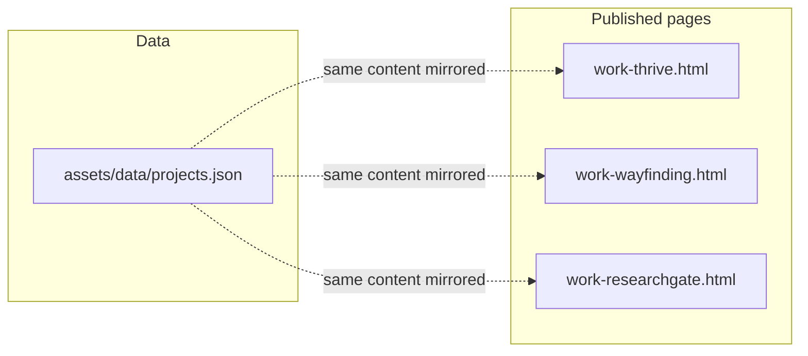

# Case study pages + data + cleanup

## Context

The repo is a **static HTML** portfolio ([index.html](c:\Users\drm23\NJIT\IS117\final_portfolio\final_portfolio\index.html), Tailwind via CDN, [aurora-glass.css](c:\Users\drm23\NJIT\IS117\final_portfolio\final_portfolio\aurora-glass.css), [aurora.js](c:\Users\drm23\NJIT\IS117\final_portfolio\final_portfolio\aurora.js)). The three case studies already have dedicated URLs:

- [pages/work-thrive.html](c:\Users\drm23\NJIT\IS117\final_portfolio\final_portfolio\pages\work-thrive.html)
- [pages/work-wayfinding.html](c:\Users\drm23\NJIT\IS117\final_portfolio\final_portfolio\pages\work-wayfinding.html)
- [pages/work-researchgate.html](c:\Users\drm23\NJIT\IS117\final_portfolio\final_portfolio\pages\work-researchgate.html)

They are currently **short placeholders** with outdated blurbs. Introducing Next.js/React ([`page.tsx` suggested in your note](c:\Users\drm23\NJIT\IS117\final_portfolio\final_portfolio)) would conflict with the current deployment model unless you add a build pipeline—**this plan keeps plain HTML** and uses JSON as a maintainable source of truth you can edit later.

## 1. Add the dataset

- Create **[assets/data/projects.json](c:\Users\drm23\NJIT\IS117\final_portfolio\final_portfolio\assets\data\projects.json)** containing the `projects` array you provided (valid JSON, no comments).
- No runtime dependency required: the site can keep working if JS is disabled; pages stay self-contained HTML.

## 2. Rebuild each case study page (same shell as the rest of the site)

For each of the three HTML files, keep the existing **head** pattern (fonts, inline Tailwind config, `aurora-glass.css`, aurora background, cursor elements, `aurora.js`).

**Recommended layout tweaks** (still matching the glass/aurora look):

- Optionally add the **same fixed nav** used on [pages/about.html](c:\Users\drm23\NJIT\IS117\final_portfolio\final_portfolio\pages\about.html) (`header` + `nav-glass`, `data-page` omitted or a neutral value) so long case studies are navigable without only a back link. Keep **“← Back to selected work”** linking to `../index.html#work`.
- Use a **wider main column** than today’s `max-w-3xl` (e.g. `max-w-4xl` or `max-w-[900px]`) so lists and metrics breathe.
- Structure content as stacked **glass-card** sections with consistent typography: mono section labels (`text-night-cerulean`, uppercase tracking), `h2`/`h3` in `font-display`, body in `text-cream-soft` / `text-cream-muted`.

**Map JSON fields to sections** (render only when non-empty):

| Area | Fields |
|------|--------|
| Hero | `title`, `subtitle`, `category`, `status`, `description` |
| Problem / goal | `problemStatement`, `goal` |
| People | `stakeholders` (list) |
| Research | `researchFindings`, `methodology`, `keyInsights` |
| Solution | `features`, `pages` (title + description as small cards or dl) |
| Extras | Wayfinding: `projectPlanning` (concept + technology list). ResearchGate: `productRequirements` (student/researcher incentives, `limitationsAddressed` sub-lists) |
| Impact | `metrics` (label, value, optional description) |
| Stack / links | `technologies`, `prototype` (external link, `target="_blank"` `rel="noopener noreferrer"`) |
| Tags | `tags` as chips (reuse border/pill styling similar to [pages/projects.html](c:\Users\drm23\NJIT\IS117\final_portfolio\final_portfolio\pages\projects.html)) |

**Three image placeholders per page** (required):

- One block, e.g. `grid grid-cols-1 gap-4 md:grid-cols-3`, three cells.
- Each cell: `aspect-[4/3]` or `aspect-video`, dashed border, muted background, accessible text like “Image placeholder 1 of 3 — replace with screen or photo”, optional `aria-hidden` decorative pattern so it’s obvious in the layout.
- Use paths reserved for later assets, e.g. `../assets/img/case-studies/{id}/01.jpg`, in a comment or `<!-- -->` next to the placeholder so swapping in real files is trivial.

**Titles:** Use JSON display names (e.g. **WayFinding** on the page even though the filename stays `work-wayfinding.html`).

## 3. Sync listing copy (optional but recommended)

Update teaser text on the home **#work** masonry cards and the **Selected work** grid on [pages/projects.html](c:\Users\drm23\NJIT\IS117\final_portfolio\final_portfolio\pages\projects.html) so Thrive, WayFinding, and ResearchGate match **`description`** / **`subtitle`** from the dataset. **Do not remove** [pages/work-funnymoney.html](c:\Users\drm23\NJIT\IS117\final_portfolio\final_portfolio\pages\work-funnymoney.html) or its cards—it is not in the JSON; leave that project as-is unless you ask to drop it later.

## 4. Run cleanup per [plan_files/cleanup.plan.md](c:\Users\drm23\NJIT\IS117\final_portfolio\final_portfolio\plan_files\cleanup.plan.md)

After case studies ship:

- Follow the cleanup steps: classify static vs unused, remove dead artifacts and unused duplicates **without changing the visual design** of pages that remain.
- **Hard constraint (your instruction):** do **not** delete any **`.md`** files or **`*.plan.md`** files; treat **[plan_files/](c:\Users\drm23\NJIT\IS117\final_portfolio\final_portfolio\plan_files)** as permanently keep.
- Document removed vs kept files and deploy risks as the cleanup plan’s Step 5 asks.

## Files touched (summary)

| Action | Path |
|--------|------|
| Create | `assets/data/projects.json` |
| Major edit | `pages/work-thrive.html`, `pages/work-wayfinding.html`, `pages/work-researchgate.html` |
| Light edit | `index.html` (work teasers), `pages/projects.html` (grid teasers) |
| Analyze/remove per cleanup | TBD (e.g. unused `assets/js/*` if truly unreferenced, empty `previewaurora.html`, etc.) — only after verifying no UI dependency |

## Risk notes

- **Single source of truth:** HTML will mirror JSON; if you change copy later, update both or accept a follow-up task to add a small build script—out of scope unless you want automation.
- **Cleanup “same UI” rule:** Any deletion must be validated against live pages (grep for references, open in browser). Markdown/plan files are explicitly excluded from deletion.
