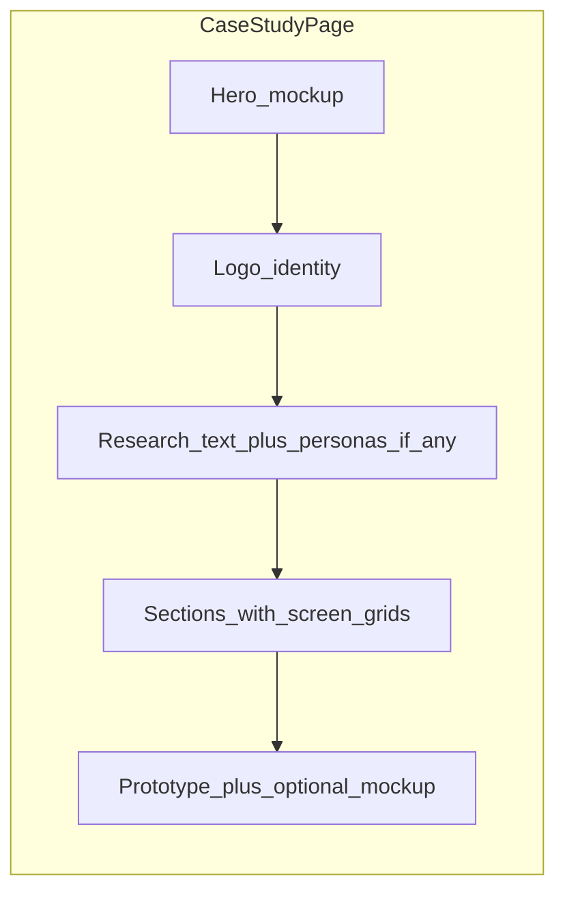

# Case study image integration plan

## Current state

- [pages/work-thrive.html](c:/Dhruvi/NJIT classes/junior/IS117/final_portfolio/pages/work-thrive.html), [pages/work-wayfinding.html](c:/Dhruvi/NJIT classes/junior/IS117/final_portfolio/pages/work-wayfinding.html), and [pages/work-researchgate.html](c:/Dhruvi/NJIT classes/junior/IS117/final_portfolio/pages/work-researchgate.html) contain **no `` elements**—only typography and lists.
- Assets are organized by project folder under [`Images/`](c:/Dhruvi/NJIT classes/junior/IS117/final_portfolio/Images/) (`Thrive`, `Wayfinding`, `ResearchGate`). **Folder name is `Wayfinding` (not `WayFinding`)**—paths must match exactly for Linux/GitHub Pages.
- Filenames include **spaces and parentheses** (e.g. `Screen (1).png`, `persona (2).png`). Use **percent-encoded `src` values** (`%20`, `%28`, `%29`) in HTML for maximum reliability across servers and tools.

## Asset-to-page mapping (by filename semantics)

| Project | Hero mockup | Logo (identity) | Personas (research) | UI screens / supporting |
|---------|-------------|-----------------|---------------------|-------------------------|
| **Wayfinding** | `Mockup 13.png` (primary hero); secondary `Mockup 5.png` / `Mockup 2.png` near outcomes or prototype | `wayfinding_Logo.png` | `persona (1).png`–`(3).png` after research insights | `Screen (1).png`–`(5).png` across Features / tech narrative |
| **Thrive** | `Mockup 1.png` or `Mockup 7.png` (pick strongest visually during implementation) | `thrive_logo.png` | **None in repo**—leave research sections text-only or add light imagery only if it fits (no invented personas) | Map to existing sections: `Profile.png`, `Mindy - plant page.png`, `Diagnosis - 1.png` / `- 2.png`, `Home.png`, `Tips.png`, `Shop.png`, `Add plant 5.png` / `8.png` / `9.png`, extra mockups `Mockup 3.png` |
| **ResearchGate** | `Mockup 17.png` or `Mockup 16.png` | `researchgate_logo.png` | **None in repo** | Onboarding/discovery flow: `Login.png`, `Choosing Universities.png`, `Choosing Interests.png`, `Event Registration.png`, `Registration Confirmation.png`; `Mockup 8.png` / `iPhone 16 - 8.png` as additional polish where layout allows |

During implementation, **open key PNGs once** to confirm hero choice and screen order match the narrative (filenames are hints only).

## HTML structure (all three pages)

1. **Hero visual** — Immediately after [`.page-summary`](c:/Dhruvi/NJIT classes/junior/IS117/final_portfolio/retro-elegance.css) (still inside [`.page-hero`](c:/Dhruvi/NJIT classes/junior/IS117/final_portfolio/retro-elegance.css)), add a single `<figure>` with one flagship mockup:
   - First image: `loading="eager"` + `fetchpriority="high"` (LCP).
   - Concise `<figcaption class="visually-hidden">` or `aria-label` only if needed for context; prefer descriptive `alt` on ``.

2. **Brand / identity** — New compact block **after Problem/Goal** (before long research body): centered logo image in a restrained frame (no long copy; optional single existing-style `case-label` such as “Brand” only if required for hierarchy—keep wording minimal per your constraint).

3. **Research / understanding** — **Wayfinding only**: after “Key Insights” (or merged with that section), a **three-column persona grid** (`persona (1)`–`(3)`). **Thrive / ResearchGate**: skip persona grid (assets absent).

4. **Supporting screens** — Insert **figures or responsive grids** after relevant sections (Features, Key Screens, Design Solutions, Outcomes) so the page reads as: text → supporting visual → text. Use **2-column grids on desktop**, **1 column ≤900px** (reuse existing breakpoint).

5. **Prototype section** — Optionally add one final mockup/device frame (`Mockup 8`, `Mockup 16`, etc.) above the external prototype link for visual closure.

6. **Accessibility** — Non-decorative images get specific `alt` text (screen/content described); decorative framing-only elements use `alt=""` and `aria-hidden="true"` if duplicated.

## CSS additions ([retro-elegance.css](c:/Dhruvi/NJIT classes/junior/IS117/final_portfolio/retro-elegance.css))

Add a small **case-study media block** (names illustrative—match existing BEM-like simplicity):

- **Hero figure**: max-width ~960px, centered, optional parchment/dark inset panel consistent with `.case-col-block` borders; image `max-width: 100%`, `height: auto`, `display: block`, `object-fit: contain` (avoid distortion).
- **Logo strip**: `max-height` clamp (~48–72px) for wordmarks, centered.
- **Persona grid**: `display: grid`; `grid-template-columns: repeat(3, 1fr)` → `1fr` under 900px; consistent gap aligned with `.metric-grid` rhythm.
- **Screen grid**: 2 columns → 1 column; uniform gaps; optional light border/shadow matching editorial style.
- **Performance**: below-fold images use `loading="lazy"`; no fixed width/height unless you measure assets (optional follow-up to reduce CLS).

Keep **[`:focus-visible`](c:/Dhruvi/NJIT classes/junior/IS117/final_portfolio/retro-elegance.css)** behavior; if any image sits inside a focusable link wrapper, ensure visible focus.

## Optional consistency pass (out of strict “case study” scope but matches “fully visual portfolio”)

- [index.html](c:/Dhruvi/NJIT classes/junior/IS117/final_portfolio/index.html) `.project-visual-panel` and [pages/projects.html](c:/Dhruvi/NJIT classes/junior/IS117/final_portfolio/pages/projects.html) cards currently use **solid color panels only**. Optionally set **`background-image`** or an absolutely positioned `` with `object-fit: cover` using the **same hero mockup** per project for parity. **Only do this if you want listing pages to match case studies**—requires a few new rules for `.project-visual-panel img` / overlay readability (keep `.proj-tag` legible).

## Verification checklist

- Click through all three case studies locally: **no 404s**, images sharp and not stretched.
- Resize viewport: **no horizontal scroll**, grids collapse cleanly (reuse existing `@media (max-width: 900px)`).
- **Lighthouse / DevTools**: one LCP candidate (hero image); lazy-load the rest.
- If PNGs are very large, **compress** externally (TinyPNG, etc.)—no code change required beyond swapping files.

